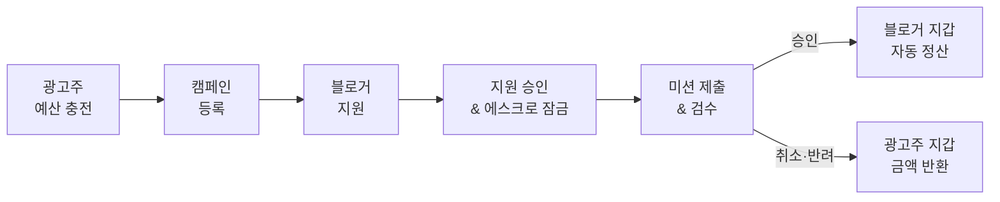

# Pacto

### 신뢰를 연결하고, 정산을 단순하게

광고주와 블로거를 연결하는 **스마트 에스크로 기반 B2B2C 캠페인 플랫폼**

---

## About Pacto

Pacto는 광고 캠페인의 모집부터 미션 수행, 검수, 정산까지 하나의 흐름으로 연결합니다.

광고주는 캠페인 예산을 미리 예치하고 진행 상황을 투명하게 관리할 수 있습니다. 블로거는 여러 캠페인을 탐색하고, 미션 승인이 완료되면 약속된 보상을 안전하게 정산받습니다. Pacto는 이 과정의 계약 단위를 에스크로 원장으로 관리해 **미정산과 정산 분쟁을 줄이는 것**을 목표로 합니다.

## How It Works

## What We Build

| 영역 | 제공 가치 |
| --- | --- |
| **Campaign Marketplace** | 캠페인 등록·탐색·지원·선정 과정을 하나로 연결합니다. |
| **Smart Escrow** | 지원자별 보상을 잠그고, 미션 결과에 따라 정산 또는 반환합니다. |
| **Wallet & Ledger** | 모든 포인트 변동을 원장에 기록해 잔액의 추적 가능성을 확보합니다. |
| **Payment Verification** | 결제 웹훅과 서버 조회를 함께 검증한 뒤 지갑에 반영합니다. |
| **Dashboard** | 광고주가 캠페인, 지원자, 미션, 예산 현황을 한눈에 관리합니다. |
| **Notification** | 주요 상태 변경을 앱 내 알림과 웹 푸시로 전달합니다. |

## Engineering Principles

- **정합성이 먼저입니다.** 결제와 정산은 트랜잭션 경계 안에서 처리하고 모든 잔액 변동을 기록합니다.
- **외부 입력을 그대로 신뢰하지 않습니다.** 결제 금액과 상태를 서버에서 다시 검증합니다.
- **핵심 거래 흐름을 장애로부터 보호합니다.** 알림과 같은 부가 작업은 커밋 이후 비동기로 실행합니다.
- **문제를 확인한 뒤 확장합니다.** 부하 테스트로 병목과 동시성 문제를 재현하고 필요한 기술을 단계적으로 도입합니다.

## Tech Stack

### Frontend

### Backend

### Infrastructure

## Repositories

| Repository | Description |
| --- | --- |
| [**Pacto-frontend-v2**](https://github.com/Pacto-Developers/Pacto-frontend-v2) | 블로거용 모바일 웹/PWA와 광고주용 대시보드를 관리하는 Next.js 모노레포 |
| [**Pacto-backend**](https://github.com/Pacto-Developers/Pacto-backend) | 인증, 캠페인, 결제, 에스크로, 지갑, 정산, 알림을 담당하는 Spring Boot API |

**Clear campaigns. Trusted settlements. Better partnerships.**

