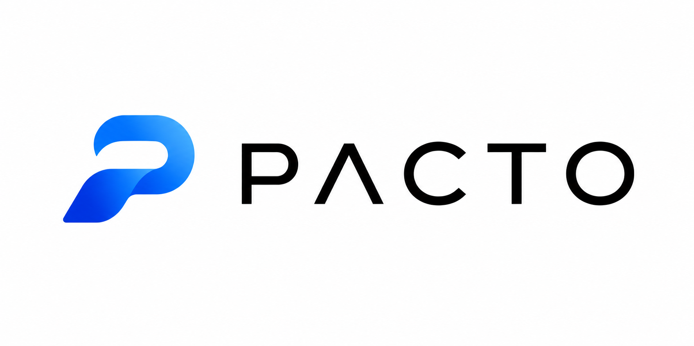
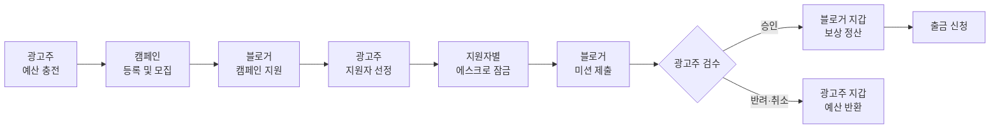
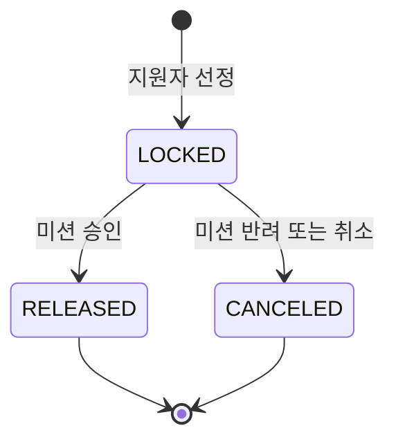
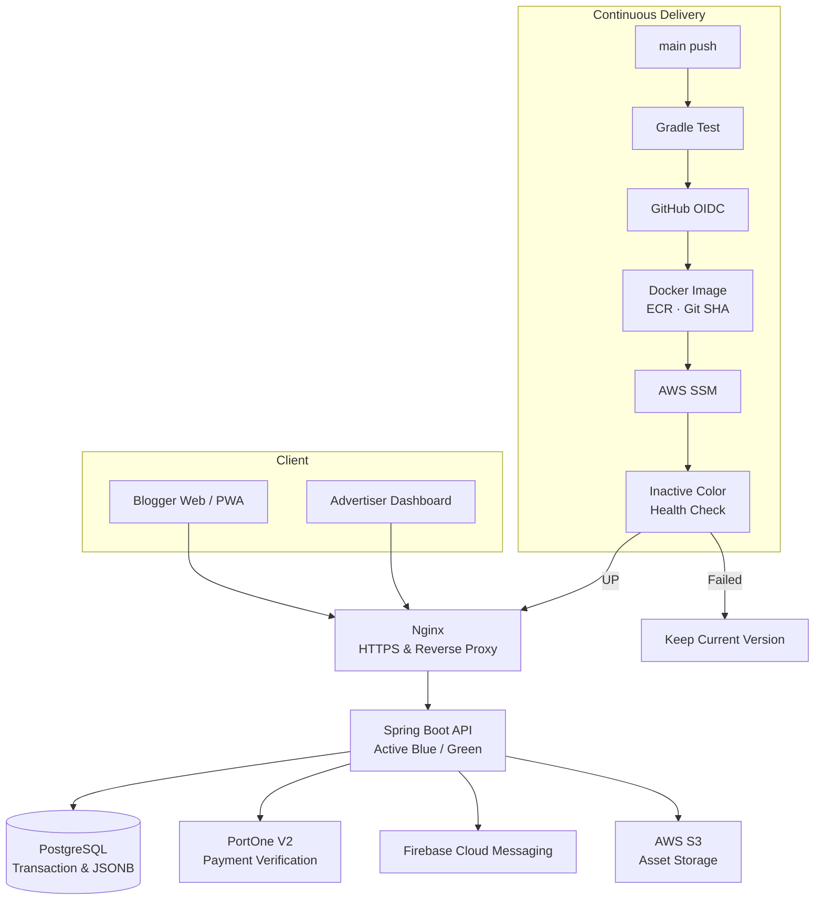

<div align="center">



# Pacto

### 신뢰를 연결하고, 정산을 단순하게

광고주와 블로거의 캠페인 전 과정을 연결하는<br/>
**스마트 에스크로 기반 B2B2C 마케팅 플랫폼**

[](https://github.com/Pacto-Developers/Pacto-backend)
[](https://github.com/Pacto-Developers/Pacto-frontend-v2)
[](https://pacto-api.duckdns.org/swagger-ui/index.html)
[](https://github.com/Pacto-Developers/Pacto-backend/actions/workflows/deploy.yml)

[Frontend](https://github.com/Pacto-Developers/Pacto-frontend-v2) · [Backend](https://github.com/Pacto-Developers/Pacto-backend) · [Swagger API](https://pacto-api.duckdns.org/swagger-ui/index.html) · [API Health](https://pacto-api.duckdns.org/actuator/health)

</div>

---

## Team Pacto

Pacto는 **백엔드 3명과 프론트엔드 1명**이 도메인별 책임을 나누고, API 계약과 코드 리뷰를 통해 하나의 제품을 함께 만들고 있습니다.

<!--
프로필 이미지 적용 방법:
1. 이미지를 profile/assets/team/ 아래의 파일명으로 추가합니다.
2. 각 팀원 카드의 img 태그를 감싼 주석만 제거합니다.
권장 이미지: 정사각형 PNG 또는 WebP, 최소 400 × 400px
-->

<table>
  <tr>
    <td align="center" valign="top" width="25%">
      <br/>
      <a href="https://github.com/yang5864"><strong>승환</strong></a><br/>
      <sub><strong>Team Lead · Backend & Infrastructure</strong></sub><br/><br/>
      프로젝트의 방향과 기술 의사결정을 이끌며, 금융 원장·에스크로 트랜잭션과 AWS 배포 인프라를 설계합니다.
    </td>
    <td align="center" valign="top" width="25%">
      <br/>
      <a href="https://github.com/Jiwon-0326"><strong>지원</strong></a><br/>
      <sub><strong>Backend · Auth & Payment</strong></sub><br/><br/>
      Spring Security·JWT 기반 인증과 역할별 프로필, PortOne V2 결제 검증 흐름을 담당합니다.
    </td>
    <td align="center" valign="top" width="25%">
      <br/>
      <a href="https://github.com/n03yij"><strong>지연</strong></a><br/>
      <sub><strong>Backend · Campaign & Mission</strong></sub><br/><br/>
      캠페인·지원·미션의 생명주기와 자동 마감 정책, S3 파일 기능을 담당합니다.
    </td>
    <td align="center" valign="top" width="25%">
      <br/>
      <a href="https://github.com/Dev-SangWoo"><strong>상우</strong></a><br/>
      <sub><strong>Frontend · Product & UX</strong></sub><br/><br/>
      블로거용 웹/PWA와 광고주 대시보드를 설계하고 API·결제 흐름을 사용자 경험으로 연결합니다.
    </td>
  </tr>
</table>

## Pacto는 무엇인가요?

Pacto는 광고 캠페인의 **예산 충전, 모집, 지원, 선정, 콘텐츠 검수, 정산**을 하나의 흐름으로 연결합니다.

기존 블로그 마케팅 시장에서는 광고주가 모집과 검수, 정산을 수작업으로 관리해야 하고 블로거는 정산 지연이나 미지급 위험을 감수해야 합니다. Pacto는 광고주가 예산을 먼저 예치하고, 블로거가 약속된 미션을 완료하면 계약 단위로 잠긴 금액을 자동 정산하는 구조로 이 문제를 해결합니다.

단순한 캠페인 게시판이 아니라, **매칭 마켓플레이스와 에스크로 정산 인프라가 결합된 SaaS-enabled Marketplace**를 지향합니다.

| 사용자 | 기존 문제 | Pacto가 제공하는 경험 |
| --- | --- | --- |
| **광고주·대행사** | 캠페인별 지원자, 미션, 예산을 여러 도구에서 관리 | 캠페인 운영과 예산 현황을 하나의 대시보드에서 관리 |
| **블로거** | 플랫폼별로 흩어진 캠페인과 불투명한 정산 과정 | 캠페인 탐색부터 지원, 미션 제출, 정산, 출금까지 한곳에서 처리 |
| **양쪽 모두** | 작업 실패와 정산 분쟁에 대한 신뢰 장치 부족 | 선예치 후 결과에 따라 지급·환불되는 스마트 에스크로 |

## 서비스 흐름



1. 회원가입 시 `ADVERTISER` 또는 `BLOGGER` 역할에 맞는 프로필과 개인 지갑이 함께 생성됩니다.
2. 광고주는 포트원 결제를 통해 캠페인 예산을 충전하고 캠페인을 등록합니다.
3. 블로거는 모집 중인 캠페인을 탐색하고 지원합니다.
4. 광고주가 지원자를 선정하면 신청 승인, 에스크로 잠금, 미션 생성, 잔여 슬롯 차감이 하나의 트랜잭션으로 처리됩니다.
5. 블로거가 콘텐츠 URL을 제출하고 광고주가 승인하면 보상이 블로거 지갑으로 이동합니다.
6. 미션이 취소되거나 반려되면 해당 지원자에게 배정된 금액만 광고주 지갑으로 반환됩니다.

## Smart Escrow

Pacto는 캠페인 전체 금액을 한 번에 정산하지 않습니다. 선정된 블로거마다 독립적인 에스크로 원장을 만들고, 각 미션의 결과에 따라 개별 정산합니다.

### 에스크로 라이프사이클



| 이벤트 | 광고주 지갑 | 블로거 지갑 | 에스크로 | 감사 로그 |
| --- | --- | --- | --- | --- |
| 결제 검증 완료 | `balance + amount` | - | - | `CHARGE` |
| 지원자 선정 | `balance - amount`, `lockedBalance + amount` | - | `LOCKED` | `LOCK` |
| 미션 승인 | `lockedBalance - amount` | `balance + amount` | `RELEASED` | `RELEASE` |
| 미션 취소·반려 | `lockedBalance - amount`, `balance + amount` | - | `CANCELED` | `REFUND` |
| 출금 신청 | - | `balance - amount` | - | `WITHDRAW` |

### 조각 정산

10명의 블로거에게 각각 100,000원을 지급하는 캠페인에서 8명만 미션을 완료했다면:

- 성공한 8건의 에스크로는 각각 `RELEASED`로 전환되고 블로거 지갑에 총 800,000원이 지급됩니다.
- 실패한 2건의 에스크로는 각각 `CANCELED`로 전환되고 광고주에게 총 200,000원이 반환됩니다.
- 일부 참여자의 실패가 이미 완료된 다른 참여자의 정산에 영향을 주지 않습니다.

### 정합성 원칙

- `1 Point = 1 KRW`를 기준으로 `balance >= 0`, `lockedBalance >= 0` 불변식을 유지합니다.
- `LOCKED`가 아닌 에스크로의 중복 정산이나 취소를 차단합니다.
- 지갑 잔액이 변경될 때마다 원본 결제·에스크로·출금 ID와 함께 `point_histories`에 기록합니다.
- 신청 승인부터 에스크로 생성과 미션 생성까지 하나라도 실패하면 전체 작업을 롤백합니다.
- 미션 승인·취소 역시 상태 변경과 금액 이동을 하나의 트랜잭션으로 처리합니다.

## 핵심 기능

| 영역 | 주요 기능 |
| --- | --- |
| **인증과 프로필** | JWT 인증, 광고주·블로거 역할 분리, 역할별 프로필 조회와 수정 |
| **캠페인** | 등록, 공개 목록, 상세 조회, 모집 마감, 진행 전환, 취소, 마감일 자동 처리 |
| **지원 관리** | 캠페인 지원, 중복 지원 방지, 지원자 조회, 선정, 거절, 지원 취소 |
| **미션** | 선정 시 자동 생성, 콘텐츠 URL 제출, 승인, 반려, 취소 |
| **결제** | 결제 요청 생성, 포트원 V2 웹훅 검증, 서버 조회 기반 결제 확정 |
| **에스크로** | 지원자별 금액 잠금, 미션 결과에 따른 정산 또는 환불 |
| **지갑** | 가용·잠금 잔액 조회, 전체 포인트 변동 이력, 출금 신청 |
| **광고주 대시보드** | 지갑·캠페인·지원·미션·에스크로 요약과 최근 활동 통합 조회 |
| **알림** | 앱 내 알림 저장, 읽음 처리, Firebase 웹푸시 등록·해제·발송 |

## 결제는 프론트엔드를 신뢰하지 않습니다

```text
결제 요청 생성
  → Payment(READY) 저장 및 merchantUid 발급
  → 프론트엔드에서 포트원 결제 진행
  → 서명된 PortOne V2 웹훅 수신
  → 웹훅 서명 검증
  → 서버가 포트원 결제 API를 직접 조회
  → paymentId · 결제 금액 · 결제 상태 교차 검증
  → Payment(PAID) 전환
  → 광고주 지갑 CHARGE 및 감사 로그 기록
```

- 클라이언트가 전달한 결제 결과나 금액만으로 지갑을 충전하지 않습니다.
- 서명 검증을 통과한 웹훅도 포트원 서버 조회 결과와 다시 비교합니다.
- 이미 처리된 결제는 상태 검증을 통해 중복 반영되지 않도록 차단합니다.

## 알림 장애가 정산을 되돌리지 않도록

지원 선정·거절과 미션 승인·반려 알림은 비즈니스 트랜잭션 안에서 먼저 DB에 저장됩니다. 트랜잭션 커밋 이후 전용 비동기 리스너가 Firebase Cloud Messaging을 호출합니다.

```text
비즈니스 상태 변경
  → Notification 저장
  → Transaction COMMIT
  → AFTER_COMMIT 이벤트
  → 비동기 FCM 발송
```

Firebase가 일시적으로 실패하더라도 이미 완료된 선정, 정산 또는 환불은 롤백되지 않습니다. 만료되거나 해제된 등록값은 비활성화해 반복 실패도 줄입니다.

## System Architecture



### 운영 배포의 안전장치

- `main` 반영 시 테스트, 이미지 빌드, ECR Push, SSM 배포가 자동 실행됩니다.
- Docker 이미지는 `latest`가 아닌 Git SHA로 식별해 코드와 배포 버전을 추적합니다.
- GitHub Actions는 저장형 AWS Access Key 대신 OIDC 단기 자격 증명을 사용합니다.
- 비활성 Blue/Green 컨테이너를 먼저 실행하고 Actuator 헬스 체크를 통과한 경우에만 Nginx 트래픽을 전환합니다.
- 신규 버전이나 Nginx 검증이 실패하면 기존 컨테이너가 계속 트래픽을 처리합니다.
- 운영 진입점은 HTTPS만 사용하며 애플리케이션 컨테이너 포트는 외부에 직접 노출하지 않습니다.

## Tech Stack

### Frontend


### Backend & Data


### Infrastructure & Delivery


| 계층 | 선택 이유 |
| --- | --- |
| **PostgreSQL** | ACID 트랜잭션으로 금융 원장의 정합성을 지키고 JSONB로 캠페인별 비정형 가이드라인을 관리합니다. |
| **Spring Boot** | 인증, 결제, 캠페인, 에스크로, 지갑 도메인을 명확한 트랜잭션 경계로 구성합니다. |
| **Next.js Monorepo** | 블로거용 모바일 웹/PWA와 광고주용 대시보드를 하나의 제품 체계에서 관리합니다. |
| **AWS & Docker** | 동일한 이미지를 검증하고 배포하며, ECR·SSM·Blue/Green으로 배포 변경 위험을 낮춥니다. |

## 현재 개발 상태

> Core MVP와 운영 배포를 완료했으며, 트래픽 대응과 관측 가능성을 높이는 단계로 확장하고 있습니다.

### 구현 완료

- [x] 광고주·블로거 역할 기반 회원가입, 로그인, 프로필, 지갑
- [x] 캠페인 등록부터 지원, 선정, 미션 제출, 승인·반려까지의 전체 흐름
- [x] 포트원 V2 결제 검증과 광고주 지갑 충전
- [x] 지원자별 에스크로 잠금, 정산, 환불과 포인트 감사 로그
- [x] 광고주 통합 대시보드와 블로거 지갑·출금 흐름
- [x] 앱 내 알림과 트랜잭션 커밋 이후 Firebase 웹푸시
- [x] HTTPS, GitHub Actions, ECR, SSM, Nginx Blue/Green 자동 배포

### Next

- [ ] 캠페인·프로필 이미지 업로드 API와 S3 연동 완성
- [ ] JMeter로 동시 지원 상황을 재현하고 Redis 분산 락으로 Double Booking 방어
- [ ] Elasticsearch 기반 캠페인 검색과 필터링 고도화
- [ ] Prometheus·Grafana 기반 운영 지표와 트래픽 관측
- [ ] Kafka 또는 Outbox 기반 알림 내구성, 재처리, 장애 격리 강화

> Redis, Elasticsearch, Prometheus, Grafana, Kafka는 목표 아키텍처이며 현재 구현 스택과 구분해 단계적으로 도입합니다.

## Engineering Principles

- **Financial integrity first** — 금액 이동과 상태 전이는 하나의 트랜잭션 안에서 처리합니다.
- **Trace every balance change** — 모든 포인트 변동에 감사 로그와 원본 참조 ID를 남깁니다.
- **Never trust external input blindly** — 결제 웹훅과 외부 결제 조회 결과를 교차 검증합니다.
- **Isolate non-critical failures** — 알림 실패가 결제와 정산 트랜잭션으로 전파되지 않도록 분리합니다.
- **Scale from evidence** — 부하 테스트로 문제를 재현한 뒤 해결에 필요한 인프라를 도입합니다.
- **Short-lived credentials** — 배포와 런타임 권한에 장기 Access Key 대신 OIDC와 Instance Profile을 사용합니다.

## Repositories

| Repository | Description |
| --- | --- |
| [**Pacto-frontend-v2**](https://github.com/Pacto-Developers/Pacto-frontend-v2) | 블로거용 모바일 웹/PWA와 광고주용 대시보드를 관리하는 Next.js 모노레포 |
| [**Pacto-backend**](https://github.com/Pacto-Developers/Pacto-backend) | 인증, 캠페인, 결제, 에스크로, 지갑, 정산, 알림을 담당하는 Spring Boot API |

<div align="center">

### Clear campaigns. Trusted settlements. Better partnerships.

</div>
